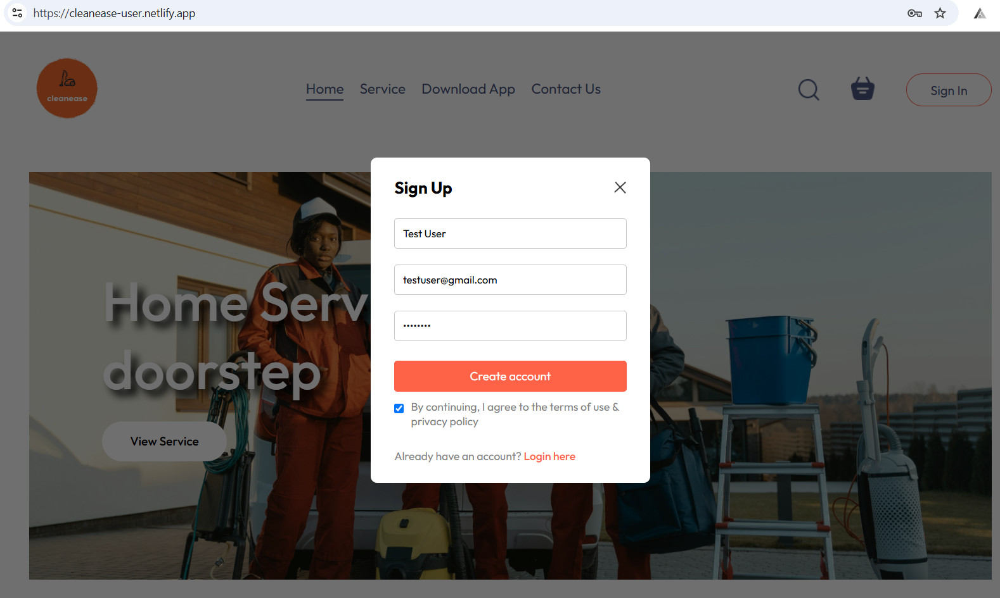

# Capstone Project

# Project Name: CleanEase

An application which helps users to book their house hold cleaning services, such as Kitchen cleaning, room cleaning, garden cleaning, etc.

## Frontend deployed in Netlify

User Portal - https://cleanease-user.netlify.app/
Admin Portal - https://cleanease-admin.netlify.app/

## App deployed in Render

https://cleanease-backend-gvsh.onrender.com/

## Documentation

Using React, Express, MongoDB and node this app can help create a cleanining service request, track the request, etc.

# 💻 Tech Stack:

## Demo

Test using Postman:

- Add Service - POST (https://cleanease-backend-gvsh.onrender.com/api/service/add)
- List Service - GET (https://cleanease-backend-gvsh.onrender.com/api/service/list)
- Remove Service - POST (https://cleanease-backend-gvsh.onrender.com/api/service/remove)
- Register User - POST (https://cleanease-backend-gvsh.onrender.com/api/user/register)
- Login User - POST (https://cleanease-backend-gvsh.onrender.com/api/user/login)
- Add to Cart - POST (https://cleanease-backend-gvsh.onrender.com/api/cart/add)
- Remove from Cart - POST (https://cleanease-backend-gvsh.onrender.com/api/cart/remove)
- Get Cart Details - POST (https://cleanease-backend-gvsh.onrender.com/api/cart/get)
- User Order Details - POST (https://cleanease-backend-gvsh.onrender.com/api/order/userorders)
- Get all order Details - GET (https://cleanease-backend-gvsh.onrender.com/api/order/list)
- Update Order status - POST (https://cleanease-backend-gvsh.onrender.com/api/order/status)
- Verify Payment - POST (https://cleanease-backend-gvsh.onrender.com/api/order/verify)

## API documentation

https://documenter.getpostman.com/view/36588127/2sAXxWbA2v

## Screenshot

1. Login - Click the "Sign In" button.

If you are a new user then select "Click here" option at the bottom to register a new user by providing a valid UserName, Email ID and Password.

If you are an existing user then Login using your existing credentials. And you will be routed to the home page.

## Installation

To run this app locally - follow the below steps.

- Download all three repositories(Cleanease-Backend, Cleanease-Frontend, Cleanease-Admin)
- Install dependencies using npm install
- Start the development server with "npm run dev"(for Frontend, and Admin projects), "npm run server"(for backend project)
- Using postman test the API endpoints(if you face any issues accessing the Render deployment URL then you can use "http://localhost:5173/"(for frontend), "http://localhost:5174/"(for admin portal) instead of render deployment URL). And the following code change is required in backend's .env file(FRONTEND_URL = "http://localhost:5173"), admin's assets.js file(export const url = 'http://localhost:4000') and in the frontend's StoreContext.jsx file update the url as "http://localhost:4000".
